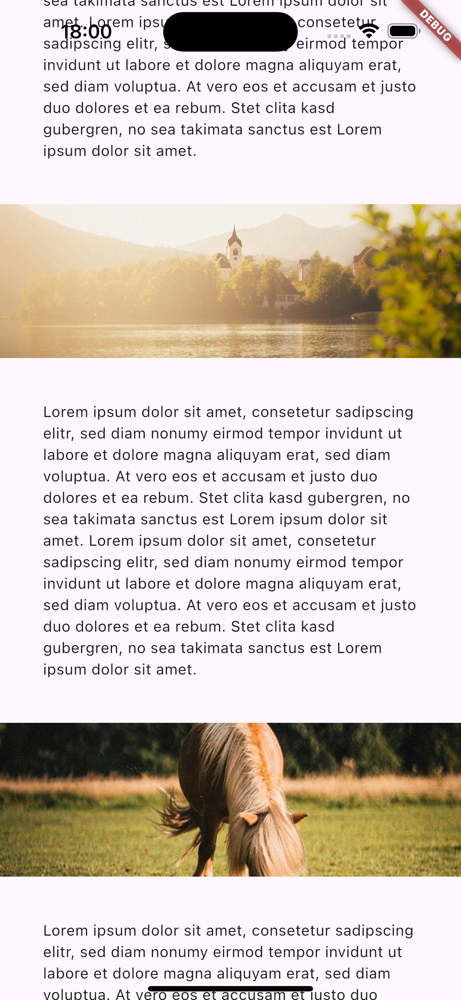

Allows widgets to break out of their padded area and ignore the padding set by the parent widget.



# Disclaimer
This package is still early in development. Hit test behaviour does not work outside the space the `Breakout` widget is in. It uses overflow to achieve the breakout effect, which means that it may not work as expected in all cases. If you have any suggestions for alternative approaches, please open an issue.

# Getting Started
To make a widget breakout you simply need to wrap it in a `Breakout` widget. For example:
```dart
Widget build(BuildContext context) {
  return SliverList.list(
    children: [
      Text('some text'),
      Breakout(
        child: Text('breakout text'),
      ),
      Text('some more text'),
    ],
  );
}
```

But the `Breakout` widget needs to know where to break out from. This is done by providing a `Breakoutable` widget in the parent widget. For example:
```dart
Widget build(BuildContext context) {
  return Breakoutable(
    insets: HorizontalBreakoutInsets(start: 40, end: 40),
    child: /* your content ... */,
  );
}
```
Make sure that the insets passed to the `Breakoutable` match the padding you want to break out of.
